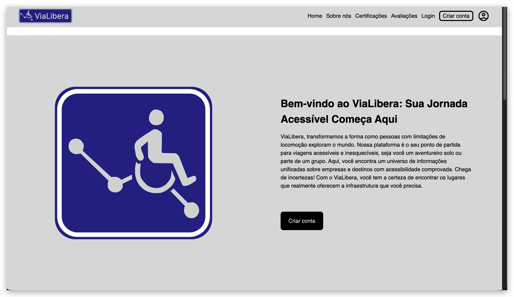

# ViaLibera 🌍♿

O ViaLibera é um projeto universitário desenvolvido como parte do Projeto Integrador do 1º semestre do curso de graduação, unificando as disciplinas de UX/UI e Desenvolvimento de Interfaces para Web.

## 💡 Objetivo

Criar uma plataforma que facilite o planejamento de viagens para pessoas com mobilidade reduzida, conectando usuários a locais e empresas que oferecem infraestrutura acessível e inclusiva.

## 🧑‍🤝‍🧑 Projeto em grupo

Trabalho realizado por um grupo de 5 alunos, onde cada um ficou responsável por uma parte. Esta versão é a página **Home**, criada por mim.

## 🔨 Tecnologias utilizadas

- HTML
- CSS
- JavaScript
- Tailwind CSS
- VS Code

## ✨ Funcionalidades

- Interface clara e acessível
- Design responsivo
- Estrutura preparada para navegação futura
- Projeto gamificado para incentivar boas práticas de acessibilidade

## 🌐 Acesse o projeto publicado

🔗 [Clique aqui para ver o ViaLibera no GitHub Pages](https://elinton-souza.github.io/vialibera)

## 🖼️ Prévia

## Contribuidores!!!

 &nbsp;
 &nbsp;